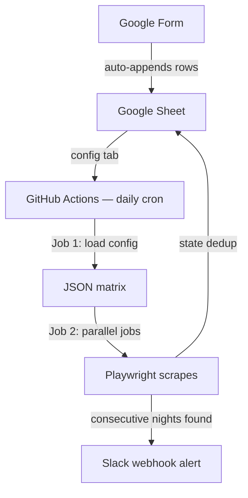

# Bookdog — Implementation Plan

## Overview
A GitHub Actions project that runs daily, reads watchdog configs from a Google Sheet, then runs up to 20 parallel Playwright jobs (matrix strategy) to scrape Booking.com property pages for availability. When N+ consecutive available nights are found, it sends a Slack alert with a direct booking link. State (previously alerted runs) is tracked in a second tab of the same Google Sheet to avoid duplicate alerts.

## Architecture



## Stack
- **Runtime:** GitHub Actions (free tier, cron-triggered, matrix jobs)
- **Language:** Node.js (ESM, `.mjs` files)
- **Browser automation:** Playwright with Chromium
- **Config & state:** Google Sheets (two tabs, accessed via Google Sheets API + service account)
- **Notifications:** Slack Incoming Webhook (single channel)

## Project structure
```
bookdog/
├── .github/workflows/
│   ├── check-availability.yml      # Production cron workflow
│   └── integration-test.yml        # Manual integration test
├── src/
│   ├── config.mjs          # Reads config from Google Sheet
│   ├── state.mjs           # Read/write state from Google Sheet
│   ├── scraper.mjs         # Playwright scraping (per-date probing)
│   ├── slack.mjs           # Slack notification helper
│   └── check.mjs           # Main entrypoint (orchestrates one watchdog run)
├── test/
│   ├── fixtures/            # Synthetic HTML test fixtures
│   ├── logic.test.mjs       # Pure logic tests (runs, dedup)
│   ├── save-snapshot.mjs    # Dev utility to capture new fixtures
│   ├── scraper.test.mjs     # Scraper tests against local fixtures
│   └── send-test-alert.mjs  # Dev utility to test Slack messages
├── .env.example
├── .gitignore
├── biome.jsonc
├── jsconfig.json
├── package.json
├── pnpm-lock.yaml
├── GUIDE.md
└── README.md
```

---

## Google Sheet structure

### Tab 1: `config`

New rows are added via a Google Form (see section 11). Editing and disabling is done directly in the Sheet.

| Column | Header | Example | Source | Notes |
|--------|--------|---------|--------|-------|
| A | `Timestamp` | `3/5/2026 14:30:00` | Google Forms (auto) | Auto-inserted by Forms |
| B | `property_url` | `https://www.booking.com/hotel/it/grand-hotel-roma.html` | Form (short answer) | Full Booking.com URL. Form validates URL contains `booking.com/hotel/` |
| C | `checkin_date` | `2026-07-01` | Form (date picker) | Start of watch window |
| D | `checkout_date` | `2026-07-31` | Form (date picker) | End of watch window |
| E | `adults` | `2` | Form (dropdown: 1-6) | Number of adult guests |
| F | `children` | `0` | Form (dropdown: 0-4) | Number of children, default 0 |
| G | `min_nights` | `4` | Form (dropdown: 2-14) | Minimum consecutive nights to trigger alert |
| H | `id` | `grand-hotel-roma-20260701-20260731-4N2A0C` | Apps Script (auto) | Auto-generated on form submit (see section 11). Format: `{slug}-{checkin}-{checkout}-{minN}N{adults}A{children}C` |
| I | `enabled` | `TRUE` | Manual in Sheet | Not in the form. Defaults to TRUE. Set to FALSE to pause. |

> **Note:** Columns A (Timestamp) and H (id) are auto-populated — A by Google Forms, H by the Apps Script trigger. Column I (enabled) is manually managed. The `config.mjs` parser must treat missing `enabled` as TRUE and missing `id` as an error (log warning, skip row).

### Tab 2: `state`

| Column | Header | Example | Notes |
|--------|--------|---------|-------|
| A | `watchdog_id` | `grand-hotel-roma-20260701-20260731-4n2a0c` | Matches `id` from config tab |
| B | `last_checked` | `2026-03-04T08:00:00Z` | ISO timestamp of last run |
| C | `alerted_runs` | `[{"start":"2026-07-10","end":"2026-07-16","nights":7}]` | JSON array of runs already alerted on |

---

## TODO

### 1. GitHub Actions workflow (`.github/workflows/check-availability.yml`)

#### Job 1: `fetch-config`
- [x] Runs on `ubuntu-latest`
- [x] Checkout repo, setup Node 20, `pnpm install` (no Playwright install needed here)
- [x] Run a script (`node src/config.mjs`) that:
  - Reads the `config` tab from Google Sheet
  - Filters to rows where `enabled` is TRUE
  - Writes a JSON array to `matrix.json`
- [x] Upload `matrix.json` as artifact (avoids GitHub Actions secret-masking on job outputs — the runner masks any output from a job that touched secrets)

#### Job 1.5: `load-config`
- [x] Downloads the `matrix` artifact (no secrets in this job → output won't be masked)
- [x] Output: `matrix` — a JSON string like `[{"id":"rome-july","property_url":"...","checkin_date":"...", ...}, ...]`

#### Job 2: `check`
- [x] `needs: load-config`
- [x] `runs-on: ubuntu-latest`
- [x] `timeout-minutes: 10`
- [x] `strategy.matrix.watchdog: ${{ fromJson(needs.load-config.outputs.matrix) }}`
- [x] `strategy.fail-fast: false` (one failure shouldn't cancel the others)
- [x] Steps: checkout → Node 20 → `pnpm install` → `npx playwright install chromium --with-deps` → run `node src/check.mjs`
- [x] Pass the current matrix entry as env: `WATCHDOG_CONFIG: ${{ toJson(matrix.watchdog) }}`
- [x] Pass secrets: `GOOGLE_SERVICE_ACCOUNT_KEY`, `SLACK_WEBHOOK_URL`, `GOOGLE_SHEET_ID`
- [x] Pass `DRY_RUN: ${{ inputs.dry_run || 'false' }}` as env to the check step
- [x] Add a test step before the main check: `pnpm test` (unit tests, fails fast)
- [x] Cron trigger: `0 8 * * *`
- [x] `workflow_dispatch` with optional boolean input `dry_run` (default: false, description: "Scrape but don't alert or write state")

### 2. Google Sheets access (`src/config.mjs` and `src/state.mjs`)

#### `src/config.mjs` (used by Job 1)
- [x] Authenticate with Google Sheets API using the service account JSON key (from env `GOOGLE_SERVICE_ACCOUNT_KEY`)
- [x] Use `googleapis` npm package (official Google API client)
- [x] Read all rows from the `config` tab of the sheet (env `GOOGLE_SHEET_ID`)
- [x] Parse into array of watchdog config objects — account for the `Timestamp` column at position A (skip it)
- [x] Treat missing or empty `enabled` column as TRUE (new rows from the form won't have it)
- [x] Filter out rows where `enabled` is explicitly FALSE
- [x] Validate each row: `id`, `property_url`, `checkin_date`, `checkout_date` must be non-empty. Log a warning and skip invalid rows.
- [x] Parse dates from Google Forms format (may come as `YYYY-MM-DD` from date picker, or locale-formatted — normalize to `YYYY-MM-DD`)
- [x] When run directly (as the entrypoint), output the JSON array to stdout; in CI, write to `matrix.json` (a separate workflow step without secrets reads this file into `$GITHUB_OUTPUT` to avoid secret-masking)
- [x] Also export a function for reuse

#### `src/state.mjs`
- [x] `readState(sheetId, watchdogId)` — read the `state` tab, find the row matching `watchdog_id`, parse `alerted_runs` JSON, return the state object (or a default empty state if not found)
- [x] `writeState(sheetId, watchdogId, state)` — update or append a row in the `state` tab with new `last_checked` and `alerted_runs`
- [x] Handle auth the same way as config.mjs

### 3. Scraper (`src/scraper.mjs`)

#### Per-date probing with per-row availability detection
- [x] For each date in the range, load the property URL with query params: `?checkin=YYYY-MM-DD&checkout=DATE+minNights&group_adults=N&group_children=N&no_rooms=1` (checkout offset = `minNights` to handle properties with minimum stay requirements)
- [x] Wait for `domcontentloaded`, then `waitForSelector('.hprt-table', { timeout: 5000 })` for JS hydration
- [x] Check room table rows (`.hprt-table tr`) for per-room availability:
  - For each row, read `.hprt-table-cell-price` text
  - If at least one row's price cell does NOT contain "not available" / "prices are not available" → date is available
  - If all rows contain unavailability text → date is sold out
- [x] No `.hprt-table` rows → treat as sold out
- [x] Add polite random delay between requests (1.5–3.5 sec)
- [x] Collect `{date: "YYYY-MM-DD", available: boolean}` array

#### Exported interface
- [x] `export async function scrapeAvailability(propertyUrl, checkinDate, checkoutDate, adults, children, minNights = 1)` → returns `{date, available}[]`
- [x] Manages its own browser lifecycle (launch → use → close)

### 4. Consecutive run detection (in `src/check.mjs` or a util)
- [x] Sort availability array by date
- [x] Walk through and find runs of consecutive `available: true` dates
- [x] Keep only runs where `nights >= minNights`
- [x] Output: array of `{start: "YYYY-MM-DD", end: "YYYY-MM-DD", nights: number}`

### 5. Deduplication logic (in `src/check.mjs`)
- [x] Read previous state via `readState()`
- [x] Compare current qualifying runs against `alerted_runs` from state
- [x] A run is "new" if no existing alerted run has the same `start` AND `end`
- [x] Only send Slack alert for new runs
- [x] After check, call `writeState()` with current runs and timestamp (overwrite, not append — we only care about the latest snapshot)

### 6. Slack notifications (`src/slack.mjs`)
- [x] `sendAlert(webhookUrl, watchdogId, propertyUrl, runs, adults, children)` — formats and sends a success alert
- [x] Message format (Slack mrkdwn):
  ```
  👋 *{watchdog_id}*
  Property: <property_url|hotel-name>

  Found availability:
  • 2026-07-10 → 2026-07-16 _(7 nights)_
  • 2026-07-20 → 2026-07-24 _(5 nights)_

  <booking_url_with_params|Book the best window (7 nights)>
  ```
- [x] The booking link should pre-fill `checkin`, `checkout` (end + 1 day), `group_adults`, `group_children`, `no_rooms=1`
- [x] `sendError(webhookUrl, watchdogId, errorMessage)` — sends an error alert:
  ```
  🚧 *{watchdog_id}*
  Check out the actions log!
  ```error message```
  ```
- [x] If `webhookUrl` is empty, print to stdout instead (for local dev)

### 7. Main entrypoint (`src/check.mjs`)
- [x] Parse watchdog config from env `WATCHDOG_CONFIG` (JSON string)
- [x] Log a summary banner (watchdog ID, property, date range, threshold)
- [x] Call `scrapeAvailability()`
- [x] Find consecutive runs
- [x] Read state, deduplicate, alert if needed, write state
- [x] Wrap everything in try/catch — on error, call `sendError()` then exit with code 1

### 8. `package.json`
- [x] `"type": "module"` for ESM
- [x] Dependencies: `playwright`, `googleapis`
- [x] Dev dependencies: `@biomejs/biome`
- [x] Package manager: `pnpm@10.29.3`
- [x] Scripts: `check`, `check.dry`, `test`, `test.alert`, `lint.check`, `lint.write`

### 9. `.gitignore`
- [x] `node_modules/`
- [x] `.env`
- [x] Credentials stored in env vars (no JSON key files to ignore)
- [x] `test/fixtures/` are **tracked** in git (they're small, and the tests need them in CI)

### 11. Google Form + Apps Script auto-ID setup

The form is the primary way to add new watchdogs. Editing/disabling/deleting is done directly in the Sheet. The watchdog ID is auto-generated by an Apps Script trigger — no manual input needed.

#### Form fields
- [x] Create a Google Form with the following fields (in order):
  1. **Property URL** — Short answer, required. Description: "Full Booking.com hotel URL (e.g. `https://www.booking.com/hotel/it/grand-hotel-roma.html`)". Add response validation: regex containing `booking.com/hotel/`
  2. **Check-in date (start of window)** — Date, required
  3. **Check-out date (end of window)** — Date, required
  4. **Adults** — Dropdown, required. Options: 1, 2, 3, 4, 5, 6
  5. **Children** — Dropdown, required. Options: 0, 1, 2, 3, 4
  6. **Minimum consecutive nights** — Dropdown, required. Options: 2, 3, 4, 5, 6, 7, 8, 9, 10, 14
- [x] Link the form to the Google Sheet: Form Settings → Responses → "Link to Sheets" → select the existing watchdog Sheet → use the `config` tab (or let it create and rename)
- [x] After linking, manually add column headers `id` (column H) and `enabled` (column I) in the Sheet

#### Apps Script trigger for auto-generating the watchdog ID
- [x] Open the Google Sheet → Extensions → Apps Script
- [x] Create a script that runs on form submission and auto-generates a deterministic, human-readable unique ID
- [x] The ID format: `{property-slug}-{checkin}-{checkout}-{minNights}N{adults}A{children}C`
  - `property-slug`: extracted from the URL path, e.g. `grand-hotel-roma`
  - `checkin`/`checkout`: `YYYYMMDD` format, e.g. `20260701`
  - Params appended: e.g. `4N2A0C` = 4 nights min, 2 adults, 0 children
  - Example: `grand-hotel-roma-20260701-20260731-4N2A0C`
  - No random hash — the combo of slug + dates + params is inherently unique
- [x] The script:
  ```javascript
  function onFormSubmit(e) {
    var sheet = e.source.getActiveSheet();
    var row = e.range.getRow();

    // Read form values (columns B-G after Timestamp in A)
    var propertyUrl = sheet.getRange(row, 2).getValue();
    var checkinDate = sheet.getRange(row, 3).getValue();
    var checkoutDate = sheet.getRange(row, 4).getValue();
    var adults      = sheet.getRange(row, 5).getValue();
    var children    = sheet.getRange(row, 6).getValue();
    var minNights   = sheet.getRange(row, 7).getValue();

    // Extract property slug from URL
    var slug = propertyUrl.split('/').pop().replace('.html', '');

    // Format dates as YYYYMMDD
    function fmtDate(d) {
      var dt = new Date(d);
      var y = dt.getFullYear();
      var m = String(dt.getMonth() + 1).padStart(2, '0');
      var day = String(dt.getDate()).padStart(2, '0');
      return '' + y + m + day;
    }

    // Build ID: slug-YYYYMMDD-YYYYMMDD-{N}N{A}A{C}C
    var id = slug + '-' + fmtDate(checkinDate) + '-' + fmtDate(checkoutDate) + '-' + minNights + 'N' + adults + 'A' + children + 'C';

    // Write ID to column H, enabled=TRUE to column I
    sheet.getRange(row, 8).setValue(id.toLowerCase());
    sheet.getRange(row, 9).setValue(true);
  }
  ```
- [x] Set up the trigger: In Apps Script → Triggers → Add trigger → `onFormSubmit` → event source "From spreadsheet" → event type "On form submit"
- [x] Test: submit a form entry, verify the `id` and `enabled` columns are auto-populated

### 12. Documentation

Split into three files:

#### `README.md` — project overview (concise)
- [x] One-liner description, links to GUIDE.md and SPEC.md
- [x] Stack, project structure tree, commands table
- [x] Disclaimer about respectful scraping

#### `GUIDE.md` — human-facing ops guide
- [x] Setup steps (service account, sheet, form, Slack, GitHub secrets)
- [x] Usage (add/edit/pause watchdogs, cron schedule)
- [x] Troubleshooting table
- [x] Free tier budget math

#### `test/README.md` — test overview
- [x] Stack (Node test runner, Playwright)
- [x] Commands, structure tree, fixture notes

---

## Testing

### 13. Dry-run mode

A permanent `--dry-run` flag that scrapes real Booking.com but skips Slack alerts and state writes. Useful for development, debugging, and verifying scraper health.

- [x] Add CLI flag support: `node src/check.mjs --dry-run` (parse from `process.argv`)
- [x] Also support env var: `DRY_RUN=true` (for use in GitHub Actions)
- [x] When dry-run is active:
  - Scraping runs normally
  - Consecutive run detection runs normally
  - State is read (for dedup comparison) but **not written**
  - Slack messages are **not sent** — instead, print the full message to stdout prefixed with `[DRY RUN]`
  - Exit code still reflects success/failure of scraping
- [x] Log a clear banner at the top: `🐶 Bookdog — DRY RUN MODE (no alerts, no state writes)`
- [x] Add a `workflow_dispatch` input to the GitHub Actions workflow:
  ```yaml
  workflow_dispatch:
    inputs:
      dry_run:
        description: 'Run without sending alerts or writing state'
        type: boolean
        default: false
  ```
  Then pass `DRY_RUN: ${{ inputs.dry_run }}` as env to the check job.

### 14. Unit tests with saved HTML snapshots

Test the scraper's DOM parsing against saved Booking.com pages without hitting the real site.

- [x] Create `test/` directory
- [x] Create `test/fixtures/` directory with saved HTML snapshots:
  - `available.html` — property page with `.hprt-table` showing available rooms (price cells)
  - `sold-out.html` — property page with no `.hprt-table` rows (fully sold out)
  - `partial-availability.html` — multi-room property where some rooms are available and some show "Not available"
  - `all-rooms-unavailable.html` — property with `.hprt-table` rows but all price cells say "Not available"
- [x] How to capture snapshots: add a utility script `test/save-snapshot.mjs` that:
  - Takes a Booking.com URL + checkin/checkout params
  - Opens the page with Playwright
  - Saves `page.content()` to a file in `test/fixtures/`
  - This is a manual dev tool, not part of CI
- [x] Create `test/scraper.test.mjs` — test the scraper against local fixtures:
  - Spin up a simple local HTTP server (use Node's built-in `http` module) serving files from `test/fixtures/`
  - Point the scraper at `http://localhost:PORT/available.html` etc. instead of real Booking.com
  - Assert: available page → `available: true`
  - Assert: sold-out page → `available: false`
  - Assert: partial-availability page → `available: true` (at least one room available)
  - Assert: all-rooms-unavailable page → `available: false` (all rows say "Not available")
- [x] Create `test/logic.test.mjs` — test pure logic functions (no browser needed):
  - `findConsecutiveRuns()`: test with various availability arrays
    - All available → one big run
    - All blocked → no runs
    - Scattered availability → correct runs detected
    - Exactly N consecutive → included; N-1 → excluded
  - Deduplication: new runs vs already-alerted runs
  - ID generation logic (if extracted to a shared util)
- [x] Test runner: use Node's built-in test runner (`node --test`) — no extra dependencies
- [x] Add to `package.json` scripts: `"test": "node --test test/*.test.mjs"`
- [x] Add a test step to the GitHub Actions workflow (runs before the actual check, fails fast):
  ```yaml
  - name: Run unit tests
    run: pnpm test
  ```

### 15. Integration test with test Slack channel

End-to-end validation of the full pipeline against a separate Slack channel.

- [x] Create a second Slack Incoming Webhook pointing to a `#bookdog-test` channel
- [x] Store as a separate GitHub Secret: `SLACK_WEBHOOK_URL_TEST`
- [x] Add a dedicated workflow: `.github/workflows/integration-test.yml`
  - Trigger: `workflow_dispatch` only (never on cron)
  - Uses a hardcoded test watchdog config (a known property with a wide date range likely to have some availability)
  - Passes `SLACK_WEBHOOK_URL_TEST` instead of the production webhook
  - Runs the full pipeline: scrape → detect runs → send alert to test channel → write state
  - The state tab can have a separate test row (watchdog ID prefixed with `test-`)
- [x] This workflow validates the full chain: Google Sheets read → Playwright scraping → Slack delivery → state write-back
- [x] Document in README: "To run the integration test, go to Actions → Integration Test → Run workflow"

### Updated project structure
```
bookdog/
├── .github/workflows/
│   ├── check-availability.yml      # Production cron workflow
│   └── integration-test.yml        # Manual integration test
├── src/
│   ├── config.mjs
│   ├── state.mjs
│   ├── scraper.mjs
│   ├── slack.mjs
│   └── check.mjs
├── test/
│   ├── fixtures/
│   │   ├── available.html
│   │   ├── sold-out.html
│   │   ├── partial-availability.html
│   │   └── all-rooms-unavailable.html
│   ├── logic.test.mjs
│   ├── save-snapshot.mjs           # Dev utility to capture new fixtures
│   ├── scraper.test.mjs
│   └── send-test-alert.mjs         # Dev utility to test Slack messages
├── .env.example
├── .gitignore
├── biome.jsonc
├── jsconfig.json
├── package.json
├── pnpm-lock.yaml
├── GUIDE.md
└── README.md
```

---

| Secret | Value |
|--------|-------|
| `SLACK_WEBHOOK_URL` | Slack incoming webhook URL (production channel) |
| `SLACK_WEBHOOK_URL_TEST` | Slack incoming webhook URL (`#bookdog-test` channel) |
| `GOOGLE_SERVICE_ACCOUNT_KEY` | Full JSON content of the Google service account key file |
| `GOOGLE_SHEET_ID` | The ID from the Google Sheet URL (the long string between `/d/` and `/edit`) |

---

## Free tier budget estimate

- 1 run/day × 30 days = 30 workflow runs
- Each run: 1 `load-config` job (~1 min) + up to 20 matrix jobs (~2-3 min each, parallel)
- Matrix jobs count individually: 30 runs × (1 + 20×3) = ~1,830 min worst case
- **With ≤15 watchdogs, full parallel matrix is safe:** 30 × (1 + 15×3) = ~1,380 min ✅
- **With 20+ active watchdogs**, consider batching: run 5 per matrix job instead of 1

> **Recommendation:** If you regularly use 20+ watchdogs, batch them (e.g. 4-5 per matrix job) instead of 1:1 matrix. The script structure supports this — just pass an array of configs to each job.